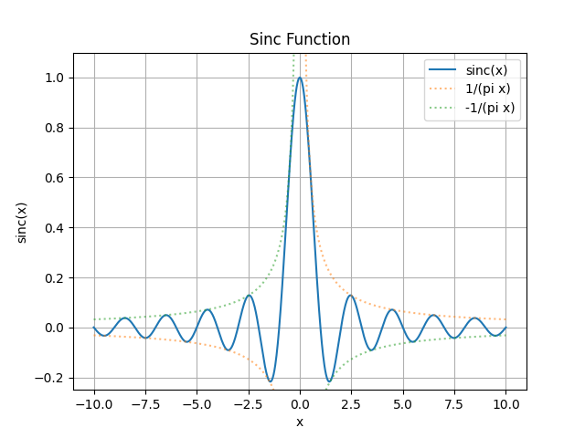

The sinc function is defined as:

$$
\text{sinc}(x) = \frac{\sin(\pi x)}{\pi x}
$$

It has the property that $\text{sinc}(0) = 1$.

# Usage

The sinc function is commonly used in signal processing, communications and optics.

